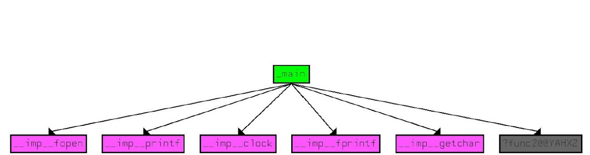
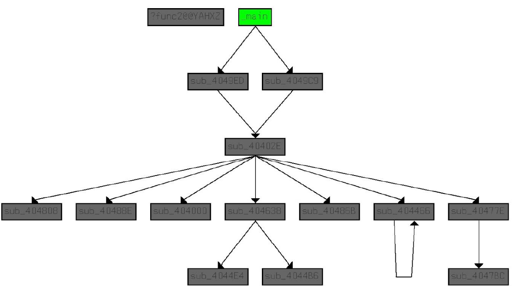

# Obfuscator
The aim of this project is the design and implementation of a cryptographic obfuscator, 
which protects software against reverse engineers. Project describes several cryptographic 
obfuscator designs, and describes in more details the implemented cryptographic. In final part, 
an analysis of the impact of obfuscation on the application performance is provided. 
Call graphs of example applications before and after obfuscation are presented as well. 
Finally, furhter wavs of slowing down the reverse engineer are discussed.
Project is just prove of concept of another obfuscation technic.
<<<<<<< HEAD

This is a callgraph of program P with some functionality F.

After obfuscation we have a callgraph of program P´ with the same functionality F.

=======
>>>>>>> 48f792c0c43b61f638e44230921ee6de0fd23f23
